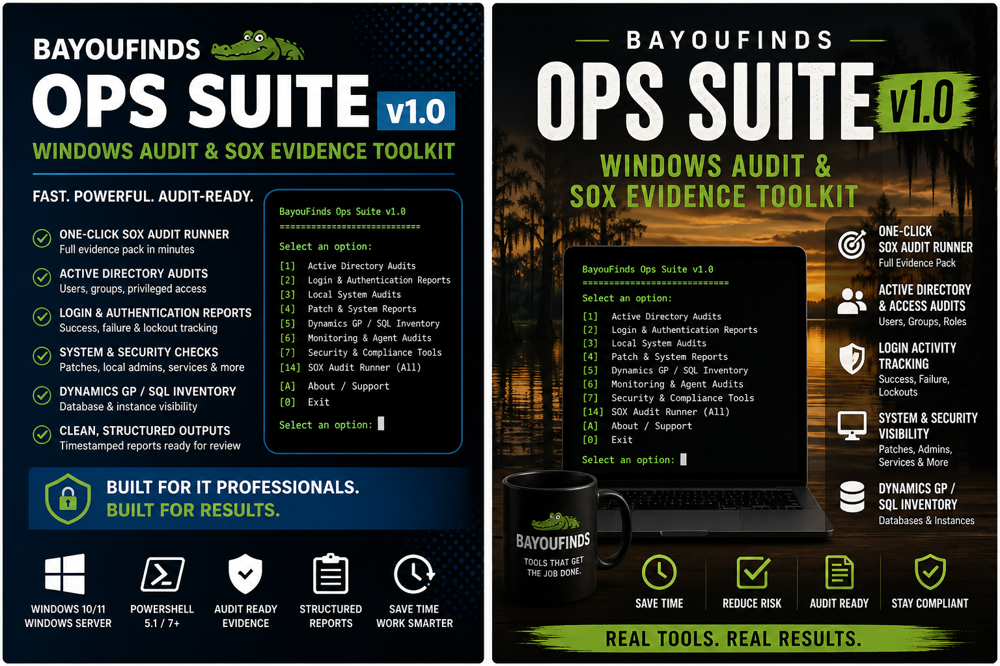
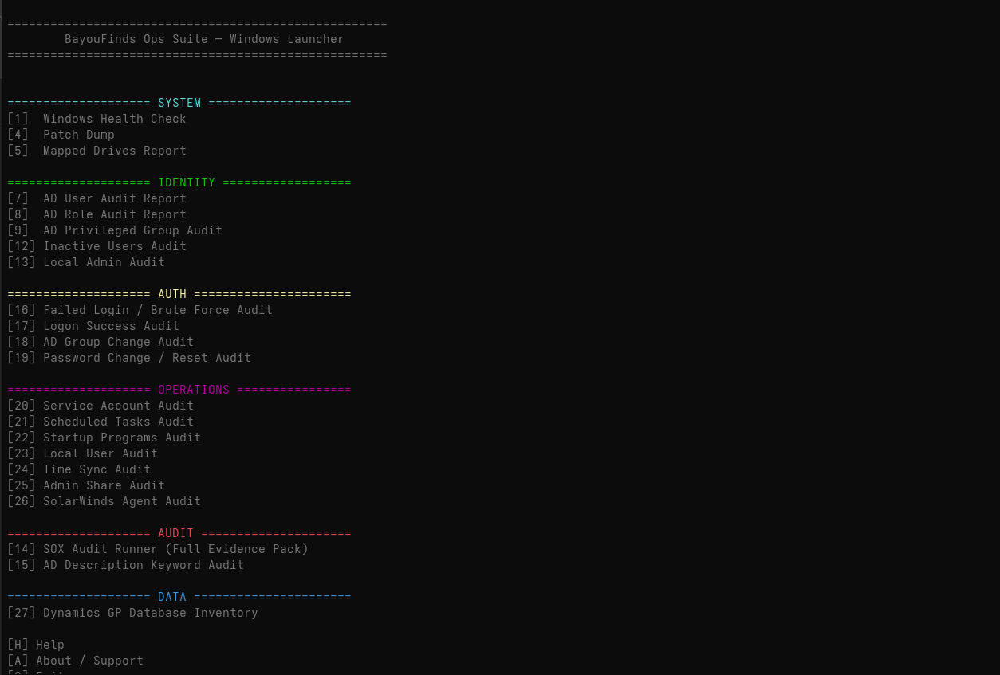
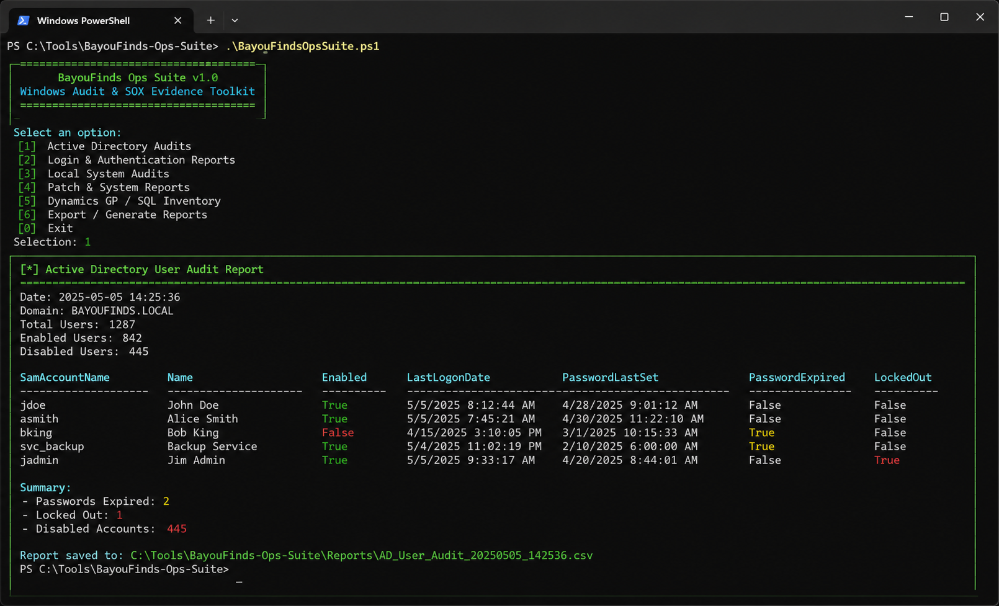

# BayouFinds Ops Suite v1.0

PowerShell-based Windows audit and SOX evidence toolkit built for Active Directory environments.

Designed to simplify recurring audit workflows, privileged group visibility, authentication reporting, and structured evidence collection.

---

## Features

- Active Directory user audits
- Privileged group visibility
- Login/authentication reporting
- Lockout tracking (4740)
- Password policy auditing
- Local admin auditing
- Structured CSV/TXT exports
- Timestamped evidence collection
- Windows Server visibility
- SOX-style audit evidence workflows

---

## Why I Built This

After years of manually collecting audit evidence during reviews and incident investigations, I wanted a cleaner and more repeatable workflow.

This toolkit consolidates recurring audit and reporting tasks into a structured PowerShell-driven workflow designed for real-world administration environments.

---

## Current Modules
---
## Screenshots

### Hero Image

### Audit Report Example

### Audit Report Example

- AD User Audit Report
- AD Role Audit Report
- Privileged Group Audit
- Password Policy Audit
- Lockout Hunter (4740)
- Access Snapshot Export / Restore
- Local Admin Audit
- Dynamics GP / SQL Inventory Visibility

---

## Built For

- System Administrators
- IT Operations
- Windows Server Environments
- Active Directory Teams
- MSPs
- Compliance Workflows
- Audit Preparation

---

## Full Toolkit

The packaged toolkit and release downloads are available here:

https://bayoufinds.com/b/fSyzm
